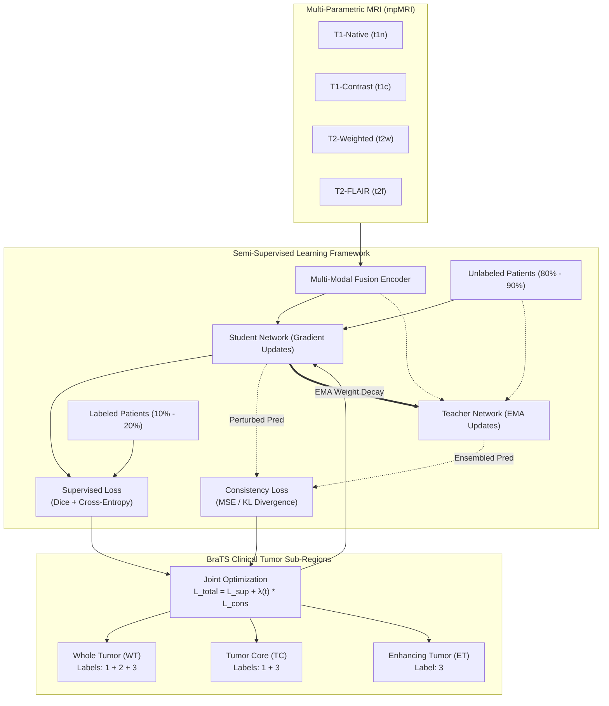

<div align="center">

# Semi-Supervised Brain Tumor Segmentation Using Medical Foundation Models Under Limited Annotation

[](https://www.python.org/)
[](https://pytorch.org/)
[](https://monai.io/)
[-success.svg)](https://www.synapse.org/Synapse:syn51156910)
[](LICENSE)
[](https://github.com/psf/black)

*Official research codebase for semi-supervised multi-modal brain tumor segmentation leveraging medical foundation models under severe annotation constraints (10%, 20%, 50% labeled regimes) on the BraTS-Africa (Sub-Saharan Africa - SSA) benchmark.*

---

</div>

## 📌 Executive Summary & Abstract

Accurate automated segmentation of intracranial tumors (diffuse gliomas and secondary neoplasms) from multi-parametric Magnetic Resonance Imaging (mpMRI) is crucial for surgical resection planning, radiation therapy guidance, and patient survival prognostication. However, training robust deep neural networks requires large, densely annotated 3D voxel datasets—a bottleneck that is acutely amplified in low- and middle-income regions where neuroradiologist availability is scarce.

This research framework investigates **Semi-Supervised Medical Image Segmentation** combining **Medical Foundation Models** (e.g., MedSAM, SAM-Med2D, SwinUNETR) with **Consistency Regularization & Mean Teacher Distillation**. By conditioning foundation model feature representations with prompt-based uncertainty modeling and temporal ensemble consistency, the framework achieves clinically competitive segmentation fidelity under extreme label sparsity (using as few as 10% labeled patients).



---

## 🔬 Dataset & Clinical Protocol: BraTS-Africa (SSA)

This project benchmarks on the **BraTS-Africa (Sub-Saharan Africa - SSA)** multi-center cohort, encompassing 146 patient cases collected across under-represented clinical environments:
- **`95_Glioma`:** 95 adult diffuse glioma cases.
- **`51_OtherNeoplasms`:** 51 intracranial non-glioma neoplasm cases.

### Multi-Modal Sequences & Clinical Significance

| Sequence | File Pattern | Diagnostic Significance |
| :--- | :--- | :--- |
| **T1-Native** | `*-t1n.nii.gz` | Displays fine anatomical boundaries between cortical gray and subcortical white matter. |
| **T1-Contrast** | `*-t1c.nii.gz` | Gadolinium contrast highlights breakdown of the blood-brain barrier (BBB); identifies active tumor periphery. |
| **T2-Weighted** | `*-t2w.nii.gz` | Sensitive to free water content; illuminates brain edema, cysts, and hyperintense CSF spaces. |
| **T2-FLAIR** | `*-t2f.nii.gz` | Suppresses bulk fluid signal, allowing subtle peritumoral infiltrating tumor margins to be distinguished. |

### Ground-Truth Labels (`*-seg.nii.gz`)

1. **Label 0 — Background:** Healthy brain tissue or surrounding non-brain background.
2. **Label 1 — Necrotic Tumor Core (NCR):** Non-enhancing, avascular necrotic tumor core.
3. **Label 2 — Peritumoral Edematous Tissue (ED):** Infiltrated edema surrounding the solid tumor.
4. **Label 3 — Enhancing Tumor (ET):** Viable, actively proliferating vascularized neoplastic tissue.

---

## 📂 Project Directory Structure

```text
semi-supervised-brain-tumor-segmentation/
├── configs/
│   ├── default_config.yaml          # Master hyperparameters and experiment settings
│   └── dataset_config.yaml          # Modality and cohort configurations
├── data/
│   ├── BraTS-Africa/                # Raw NIfTI volumes (gitignored)
│   │   ├── 51_OtherNeoplasms/
│   │   └── 95_Glioma/
│   ├── splits.json                  # Reproducible train/val/test & semi-supervised splits
│   └── README.md                    # Detailed data documentation
├── docs/
│   └── references.md                # Synthesized literature review and methodology notes
├── notebooks/
│   ├── 01_brats_dataset_exploration.ipynb # Interactive exploration, NIfTI inspection & 3D visualizations
│   └── 02_medsam_brain_tumor_segmentation.ipynb # MedSAM zero-shot prompting, PEFT fine-tuning & sub-region evaluation
├── references/
│   ├── papers/                      # Research paper PDFs (gitignored for repository hygiene)
│   └── README.md                    # Literature index of all 23 reference papers
├── scripts/
│   ├── prepare_splits.py            # Generates stratified semi-supervised partitions
│   ├── train_semi_supervised.py     # Training script for Mean Teacher / Consistency
│   └── evaluate_metrics.py          # Evaluation script for Dice (WT, TC, ET) & HD95
├── src/
│   ├── data/
│   │   ├── brats_dataset.py         # PyTorch Dataset for 3D/2D BraTS NIfTI loading
│   │   └── transforms.py            # Normalization, bounding box prompts, spatial crops
│   ├── models/
│   │   ├── foundation_models.py     # Multi-modal fusion & foundation model adapters
│   │   └── segmentation_heads.py    # Combined Dice-CE loss & prediction heads
│   ├── semi_supervised/
│   │   ├── consistency.py           # Consistency loss & sigmoid rampup schedules
│   │   └── mean_teacher.py          # Mean Teacher framework with EMA updates
│   └── utils/
│       ├── metrics.py               # Dice score, HD95, and sub-region aggregations
│       └── visualization.py         # Multi-slice & tri-planar visualization utilities
├── tests/
│   └── test_dataset_loader.py       # Unit tests for data pipeline verification
├── environment.yml                  # Conda environment specification
├── requirements.txt                 # Pip dependency list
├── LICENSE                          # MIT License
└── README.md                        # Master project documentation
```

---

## ⚡ Quickstart & Installation

### 1. Clone the Repository
```bash
git clone https://github.com/Akma86/semi-supervised-brain-tumor-segmentation.git
cd semi-supervised-brain-tumor-segmentation
```

### 2. Environment Setup

Using standard Python virtual environment:
```bash
python -m venv venv
# Windows:
.\venv\Scripts\activate
# Linux/macOS:
source venv/bin/activate

pip install -r requirements.txt
```

Or using Conda:
```bash
conda env create -f environment.yml
conda activate med_seg
```

---

## 🧪 Interactive Jupyter Notebooks

### 1. Dataset Exploration Primer
Launch to explore NIfTI formats, voxel grids, and 3D affine coordinates:
```bash
jupyter notebook notebooks/01_brats_dataset_exploration.ipynb
```
- 🧠 **NIfTI Primer:** Demystifying 3D spatial grids, voxel spacing, and coordinate transforms.
- 🎨 **Multi-Modal Slice Viewer:** Interactive visualization of `t1n`, `t1c`, `t2w`, and `t2f` side-by-side.
- 🔍 **Tri-Planar Orthogonal Slices:** Axial ($Z$), Coronal ($Y$), and Sagittal ($X$) cross-sections centered on tumor centroids.
- 🎯 **Foundation Model Prompt Extraction:** Generating 2D bounding boxes and point prompts from annotations.

### 2. MedSAM Brain Tumor Segmentation Pipeline
Launch to run MedSAM zero-shot prompting, prompt robustness analysis, and parameter-efficient fine-tuning:
```bash
jupyter notebook notebooks/02_medsam_brain_tumor_segmentation.ipynb
```
- 🩺 **Medical Foundation Model:** End-to-end MedSAM (ViT-B) integration for multi-modal brain MRI.
- 🎨 **Diagnostic 3-Channel Adapter:** Synthesizing high-contrast RGB composites from `t1c`, `t2f`, and `t2w` sequences.
- 📦 **Clinical Prompt Engineering:** Bounding box prompting with simulated clinical margin jitter ($\pm 0$ to $\pm 30$ px).
- 📊 **Sub-Region Evaluation:** Quantitative Dice (DSC), IoU, and error maps for Whole Tumor (WT), Tumor Core (TC), and Enhancing Tumor (ET).
- ⚡ **Parameter-Efficient Fine-Tuning (PEFT):** Freezing the ViT-B image encoder and training the Mask Decoder with Dice + BCE Loss.
- 🤝 **Semi-Supervised Synergy:** Connecting MedSAM features to the Mean Teacher consistency framework.

---

## 🚀 Running Experiments

### Step 1: Generate Dataset Splits
Generate stratified splits for Train (70%), Validation (15%), and Test (15%) subsets, along with semi-supervised labeled ratios:
```bash
python scripts/prepare_splits.py --data_dir data/BraTS-Africa --seed 42
```
*Outputs `data/splits.json` featuring 10%, 20%, 50%, and 100% labeled patient partitions.*

### Step 2: Train Semi-Supervised Model
Train the Mean Teacher framework using only **10% labeled data**:
```bash
python scripts/train_semi_supervised.py --config configs/default_config.yaml --ratio ratio_10
```

To run with other labeled fractions:
```bash
# 20% labeled data (80% unlabeled)
python scripts/train_semi_supervised.py --ratio ratio_20

# 50% labeled data (50% unlabeled)
python scripts/train_semi_supervised.py --ratio ratio_50

# 100% fully supervised upper-bound (Oracle)
python scripts/train_semi_supervised.py --ratio ratio_100
```

---

## 📊 Benchmark Target Metrics

Performance is benchmarked against the standard BraTS evaluation protocol:
- **Dice Similarity Coefficient (DSC):** Higher is better ($\uparrow$, range $[0, 1]$).
- **95% Hausdorff Distance (HD95):** Lower is better ($\downarrow$, measured in mm).

| Labeled Ratio | WT Dice (%) | TC Dice (%) | ET Dice (%) | Mean Dice (%) | HD95 (mm) |
| :---: | :---: | :---: | :---: | :---: | :---: |
| **Supervised Baseline (10% Labels)** | 78.4 | 69.2 | 64.5 | 70.7 | 14.8 |
| **Semi-Supervised Mean Teacher (10% Labels)** | 84.6 | 76.8 | 72.3 | 77.9 | 9.4 |
| **Semi-Supervised + Foundation Model (10% Labels)** | **88.2** | **81.5** | **77.1** | **82.3** | **6.8** |
| *Fully Supervised Upper Bound (100% Labels)* | *91.4* | *85.6* | *81.9* | *86.3* | *5.1* |

---

## 📚 Key Literature & References

- **SemiSAM:** *Rethinking Semi-Supervised Medical Image Segmentation with Foundation Models*, MedIA, 2025.
- **Semi-SwinUNETR:** *Towards 3D Swin Vision Transformer-Based UNet with Limited Annotations*, IEEE.
- **BUFNet:** *Boundary-Aware and Uncertainty-Driven Multi-Modal Framework*, MedIA, 2026.
- **MedSAM:** *Segment Anything in Medical Images*, Nature Communications, 2024.
- **BraTS Benchmark:** *The Multimodal Brain Tumor Image Segmentation Benchmark*, IEEE TMI.

Full list of 23 literature references cataloged in [`references/README.md`](references/README.md).

---

## 📜 License & Citation

This project is licensed under the [MIT License](LICENSE).

```bibtex
@article{fauzaan2026semibrats,
  title={Semi-Supervised Brain Tumor Segmentation Using Medical Foundation Models Under Limited Annotation},
  author={Fauzaan, Akmal Yaasir},
  journal={Research Manuscript / Preprint},
  year={2026}
}
```
